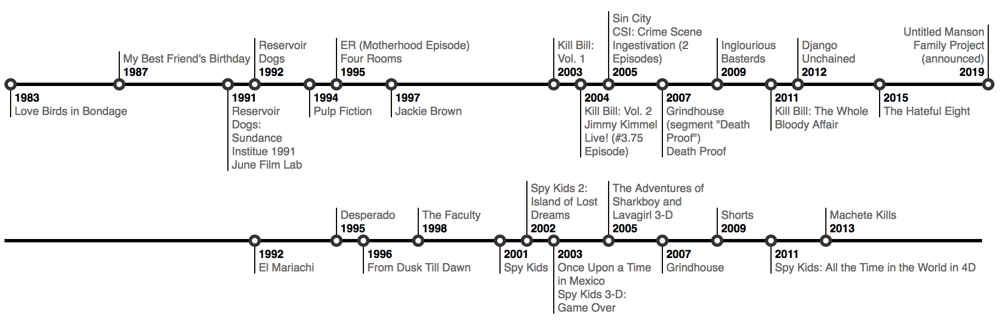

# Milestones Visualization for Kibana

This Kibana plugin provides a milestones timeline visualization.



## Compatibility

This is work in progress. The plugin should work with Kibana version `7.0.0-alpha1`.

## Installation

### General Installation Pattern

```
bin/kibana-plugin install https://github.com/elastic/kibana-milestones-vis/releases/download/v<version>/kibana-milestones-vis-<version>.zip
```

### Installing the first alpha release

```
bin/kibana-plugin install https://github.com/elastic/kibana-milestones-vis/releases/download/v1.0.0-alpha1/kibana-milestones-vis-1.0.0-alpha1.zip
```

## Usage

- Create a Kibana index pattern including a time filter.
- Go to `Visualize > Create New Visualization` and choose the Milestones visualization in the Time Series section.
- In the next view, pick the index pattern you created.
- You should end up on the visualization's page where you can tweak it:
  - Make sure you have the right time span selected (upper right corner)
  - In the Top Hits configuration, choose a field for "Sort On" which you want to use for the labels. By default it just picks timestamps.
  - While Elasticsearch/Kibana aggregates the data automatically, in the options panel you still can set an additional client side custom aggregation which will affect the grouping and label style. This also allows grouping by a year's quarters which isn't available as a bucket size with Elasticsearch's native aggregations.

## Development

See the [kibana contributing guide](https://github.com/elastic/kibana/blob/master/CONTRIBUTING.md) for instructions setting up your development environment. Once you have completed that, use the following npm tasks.

  - `npm start`

    Start kibana and have it include this plugin

  - `npm start -- --config kibana.yml`

    You can pass any argument that you would normally send to `bin/kibana` by putting them after `--` when running `npm start`

  - `npm run build`

    Build a distributable archive

  - `npm run test:browser`

    Run the browser tests in a real web browser

  - `npm run test:server`

    Run the server tests using mocha

For more information about any of these commands run `npm run ${task} -- --help`.
