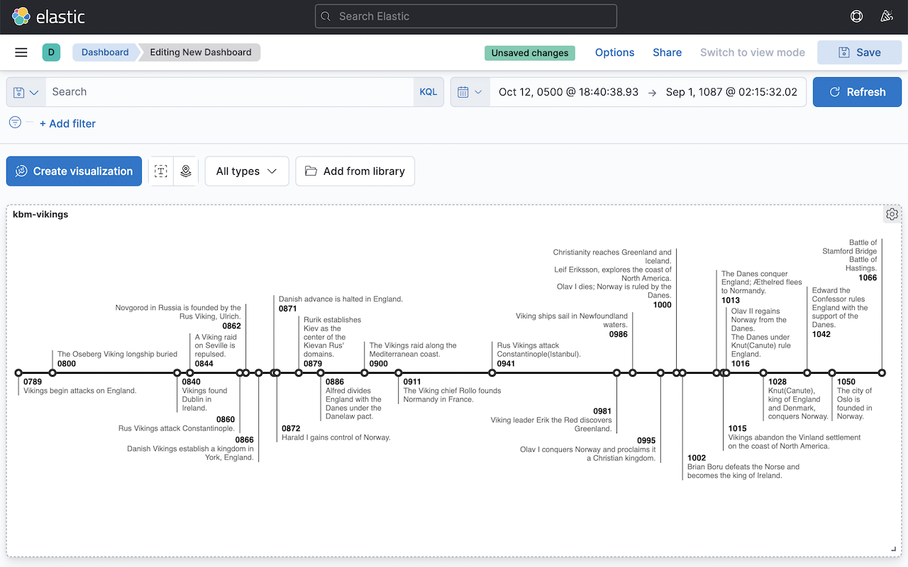

# Milestones Visualization for Kibana



This plugin is a wrapper for the stand-alone library `d3-milestones` (https://github.com/walterra/d3-milestones) to make its functionality available within Kibana.

## Installation

### Compatibility

To get a version of this plugin which is compatible with your version of Kibana, have a look at the releases page on GitHub: https://github.com/walterra/kibana-milestones-vis/releases

The releases of this plugin are synced with Kibana's release cycle. In the "Assets" section of each release you'll find a zipped build of the plugin which you can use. These zip files are named in the following way: `kibanaMilestonesVis-<plugin-version>.zip`. The `plugin-version` should match the version of Kibana you're using.

### General Installation Pattern

Run the following from within your Kibana folder:

```
bin/kibana-plugin install https://github.com/walterra/kibana-milestones-vis/releases/download/v7.17.5/kibanaMilestonesVis-7.17.5.zip
```

### Installing by first downloading a zipped release

- Head over to https://github.com/walterra/kibana-milestones-vis/releases and download the ZIP of the version you want to use, e.g. https://github.com/walterra/kibana-milestones-vis/releases/download/v7.17.5/kibanaMilestonesVis-7.17.5.zip
- Inside your kibana directory, run `bin/kibana-plugin install file:///<path-to-file>/kibanaMilestonesVis-7.17.5.zip`, then `npm run start`

## Usage

- Create a Kibana index pattern including a time filter.
- Go to `Visualize > Create New Visualization` and choose the Milestones visualization in the Time Series section.
- In the next view, pick the index pattern you created.
- You should end up on the visualization's page where you can tweak it. Make sure you have the right time span selected (upper right corner).
- The visualization works best with sparse data. While there is some optimization going on to distribute labels, you might get irritating results with data which results in too many labels.

## Development

See [DEVELOPMENT.md](DEVELOPMENT.md).
